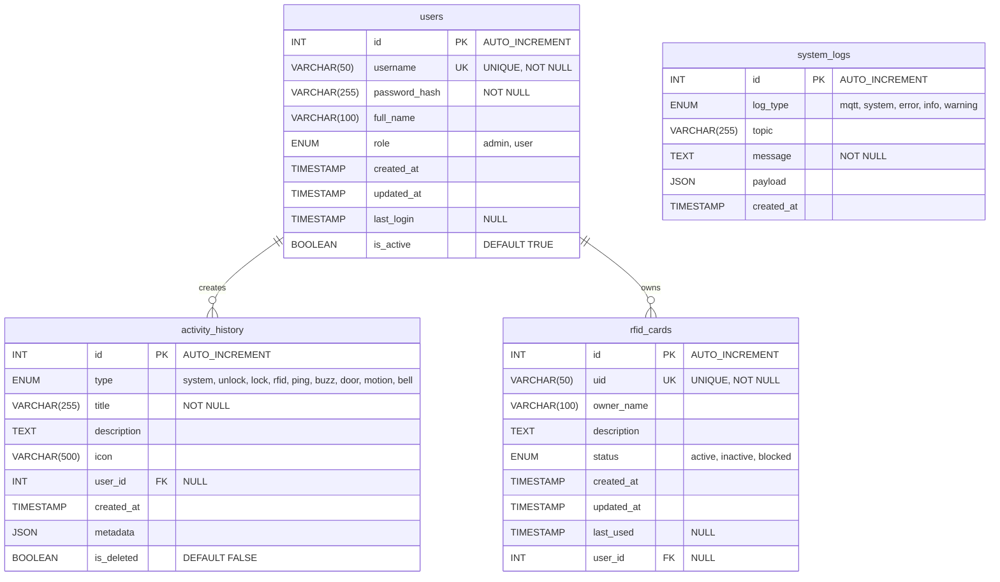
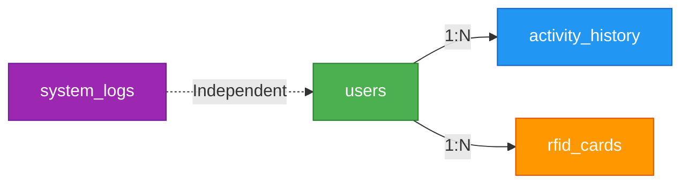
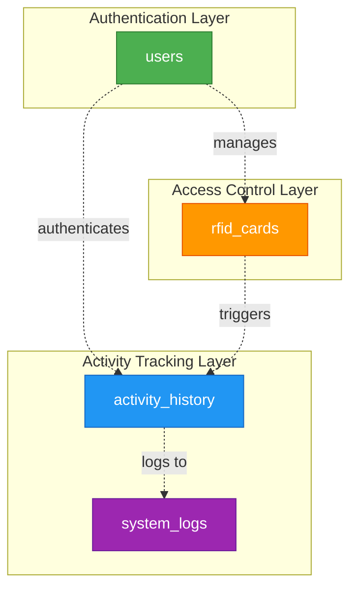

# Cấu Trúc Database - IoT Smart Door System

## Tổng Quan

Database của hệ thống IoT Smart Door được thiết kế để quản lý người dùng, lịch sử hoạt động, thẻ RFID và log hệ thống. Hệ thống sử dụng MySQL/MariaDB với engine InnoDB và charset UTF-8.

## Sơ Đồ ERD (Entity Relationship Diagram)



## Chi Tiết Các Bảng

### 1. **users** - Quản Lý Người Dùng

Bảng này lưu trữ thông tin người dùng và quản trị viên của hệ thống.

| Cột | Kiểu Dữ Liệu | Mô Tả |
|-----|--------------|-------|
| `id` | INT (PK) | ID tự động tăng |
| `username` | VARCHAR(50) | Tên đăng nhập (duy nhất) |
| `password_hash` | VARCHAR(255) | Mật khẩu đã mã hóa (bcrypt) |
| `full_name` | VARCHAR(100) | Họ và tên đầy đủ |
| `role` | ENUM | Vai trò: 'admin' hoặc 'user' |
| `created_at` | TIMESTAMP | Thời gian tạo tài khoản |
| `updated_at` | TIMESTAMP | Thời gian cập nhật cuối |
| `last_login` | TIMESTAMP | Lần đăng nhập cuối cùng |
| `is_active` | BOOLEAN | Trạng thái kích hoạt |

**Indexes:**
- `idx_username` - Tìm kiếm nhanh theo username
- `idx_role` - Lọc theo vai trò

---

### 2. **activity_history** - Lịch Sử Hoạt Động

Bảng này ghi lại tất cả các hoạt động của hệ thống (mở khóa, quét thẻ, cảm biến, v.v.).

| Cột | Kiểu Dữ Liệu | Mô Tả |
|-----|--------------|-------|
| `id` | INT (PK) | ID tự động tăng |
| `type` | ENUM | Loại hoạt động (unlock, lock, rfid, door, motion, bell, v.v.) |
| `title` | VARCHAR(255) | Tiêu đề hoạt động |
| `description` | TEXT | Mô tả chi tiết |
| `icon` | VARCHAR(500) | Icon Font Awesome |
| `user_id` | INT (FK) | ID người dùng (nếu có) |
| `created_at` | TIMESTAMP | Thời gian hoạt động |
| `metadata` | JSON | Dữ liệu bổ sung (JSON) |
| `is_deleted` | BOOLEAN | Đánh dấu đã xóa (soft delete) |

**Indexes:**
- `idx_type` - Lọc theo loại hoạt động
- `idx_created_at` - Sắp xếp theo thời gian
- `idx_user_id` - Lọc theo người dùng
- `idx_is_deleted` - Lọc bản ghi đã xóa

**Foreign Keys:**
- `user_id` → `users(id)` ON DELETE SET NULL

---

### 3. **rfid_cards** - Quản Lý Thẻ RFID

Bảng này quản lý các thẻ RFID được phép truy cập hệ thống.

| Cột | Kiểu Dữ Liệu | Mô Tả |
|-----|--------------|-------|
| `id` | INT (PK) | ID tự động tăng |
| `uid` | VARCHAR(50) | UID thẻ RFID (duy nhất) |
| `owner_name` | VARCHAR(100) | Tên chủ thẻ |
| `description` | TEXT | Mô tả thẻ |
| `status` | ENUM | Trạng thái: 'active', 'inactive', 'blocked' |
| `created_at` | TIMESTAMP | Thời gian tạo |
| `updated_at` | TIMESTAMP | Thời gian cập nhật |
| `last_used` | TIMESTAMP | Lần sử dụng cuối |
| `user_id` | INT (FK) | ID người dùng sở hữu |

**Indexes:**
- `idx_uid` - Tìm kiếm nhanh theo UID
- `idx_status` - Lọc theo trạng thái

**Foreign Keys:**
- `user_id` → `users(id)` ON DELETE SET NULL

---

### 4. **system_logs** - Log Hệ Thống

Bảng này ghi lại các log hệ thống, MQTT messages và lỗi.

| Cột | Kiểu Dữ Liệu | Mô Tả |
|-----|--------------|-------|
| `id` | INT (PK) | ID tự động tăng |
| `log_type` | ENUM | Loại log: 'mqtt', 'system', 'error', 'info', 'warning' |
| `topic` | VARCHAR(255) | MQTT topic (nếu có) |
| `message` | TEXT | Nội dung log |
| `payload` | JSON | Dữ liệu payload (JSON) |
| `created_at` | TIMESTAMP | Thời gian ghi log |

**Indexes:**
- `idx_log_type` - Lọc theo loại log
- `idx_created_at` - Sắp xếp theo thời gian
- `idx_topic` - Tìm kiếm theo MQTT topic

---

## Mối Quan Hệ (Relationships)



### Giải Thích Mối Quan Hệ:

1. **users → activity_history** (1:N)
   - Một người dùng có thể tạo nhiều hoạt động
   - Foreign key: `activity_history.user_id`
   - ON DELETE: SET NULL (giữ lịch sử khi xóa user)

2. **users → rfid_cards** (1:N)
   - Một người dùng có thể sở hữu nhiều thẻ RFID
   - Foreign key: `rfid_cards.user_id`
   - ON DELETE: SET NULL (giữ thông tin thẻ khi xóa user)

3. **system_logs** (Independent)
   - Bảng độc lập, không có foreign key
   - Ghi lại tất cả log hệ thống

---

## Dữ Liệu Mẫu

### Default Admin Account
```sql
username: admin
password: Admin123@ (hashed)
role: admin
```

### Default RFID Cards
| UID | Owner | Status |
|-----|-------|--------|
| A1B2C3D4 | Admin Card | active |
| E5F6G7H8 | User Card 1 | active |

---

## Đặc Điểm Kỹ Thuật

- **Engine:** InnoDB (hỗ trợ transactions và foreign keys)
- **Charset:** UTF-8 (utf8mb4_unicode_ci)
- **Soft Delete:** Sử dụng cột `is_deleted` trong `activity_history`
- **JSON Support:** Metadata và payload được lưu dưới dạng JSON
- **Indexing:** Tối ưu hóa truy vấn với indexes trên các cột thường xuyên tìm kiếm

---

## Sơ Đồ Kiến Trúc Dữ Liệu



---

## Tóm Tắt

Database được thiết kế với 4 bảng chính:
- **users**: Quản lý người dùng và phân quyền
- **activity_history**: Ghi lại mọi hoạt động của hệ thống
- **rfid_cards**: Quản lý thẻ RFID và quyền truy cập
- **system_logs**: Lưu trữ log hệ thống và MQTT messages

Thiết kế này đảm bảo:
- Bảo mật với mã hóa mật khẩu
- Theo dõi hoạt động chi tiết
- Quản lý quyền truy cập linh hoạt
- Ghi log đầy đủ cho debugging
